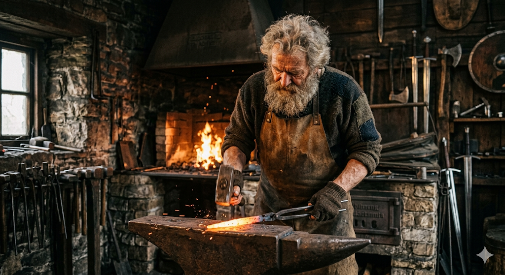

# 神秘の鍛冶場 (The Arcane Forge) - 完全攻略マニュアル

『神秘の鍛冶場』へようこそ。本作は、伝説の武器職人を目指すブラウザベースのクリック＆マネジメントゲームです。
中世ファンタジーの世界でリソースを集め、王国からの依頼に応え、世界に名を馳せる鍛冶聖を目指しましょう。

**プレイはこちら:** [GitHub Pages Project URL](https://y226t166-hash.github.io/my-app-2026/)

---

## 🧭 ゲームの目的
あなたの最終目標は、王国騎士団からの**【最終依頼】**を完遂し、**「伝説の鍛冶聖」**の称号を得ることです。

---

## 🛠 基本システム解説

### 1. リソース収集 (Gather)
鍛造に必要な4つの素材を確保しましょう。
- 💰 **ゴールド**: 従業員の雇用や高度なレシピに必要です。
- ⛓️ **鉄**: 武器や防具の主原料です。
- 🪵 **木材**: 柄や補助材料として使われます。
- 💎 **マナ**: 魔法の装備や伝説級の武具に不可欠な神秘の力です。

### 2. 鍛造 (Forge) & 一括作成
レシピを選んで装備を作ります。
- **一括作成**: 数量を入力することで、一度に複数の装備を鍛造できます。
- **効率アップ**: まとめて作ることで、1個あたりの鍛造時間が短縮される職人ボーナスが発生します。

### 3. 装備の種類と性能
武器だけでなく、盾や鎧も製作可能です。
- ⚔️ **武器**: 攻撃力に優れます。
- 🛡️ **盾・鎧**: 防御力に優れます。
- **レアリティ**: 一般(Common)から伝説(Legendary)まで、完成時にランダムで格付けされます。

### 4. 依頼 (Quests) **[NEW!]**
画面上の「依頼」タブから、街の人々や王国の要請を確認できます。
- 依頼品を納品することで、多額の報酬と**「称号（ランク）」**を獲得できます。
- 全ての依頼を達成すると、特別なエンディングが待っています。

---

## 👥 鍛冶場の運営

### 従業員の雇用
稼いだゴールドで、自動的にリソースを集めてくれる職人たちを雇うことができます。
- **技術研修**: あなた自身のクリック効率を上げます。
- **見習い採掘師/木こり/魔力探求者**: あなたが休んでいる間も素材を集め続けます。

---

## 🎵 演出と設定

- **中世風BGM**: ヘッダーのスピーカーアイコン（🔇/🔊）から、中世風の情緒豊かなBGMをオンにできます。
- **自動保存**: ゲームの進捗はブラウザに自動保存されます。

---

## 🚀 開発情報
- **技術構成**: HTML5 / Vanilla CSS / JavaScript (Web Audio API)
- **特徴**: 外部ライブラリを一切使用せず、軽量かつ自己完結型の構成になっています。
